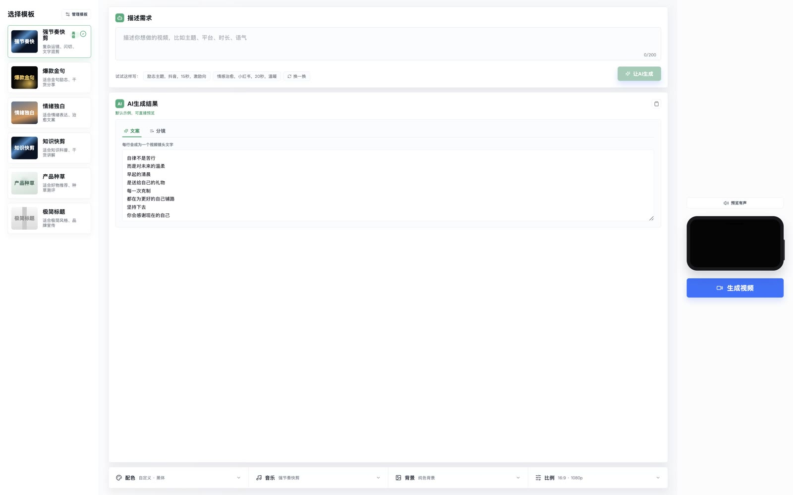
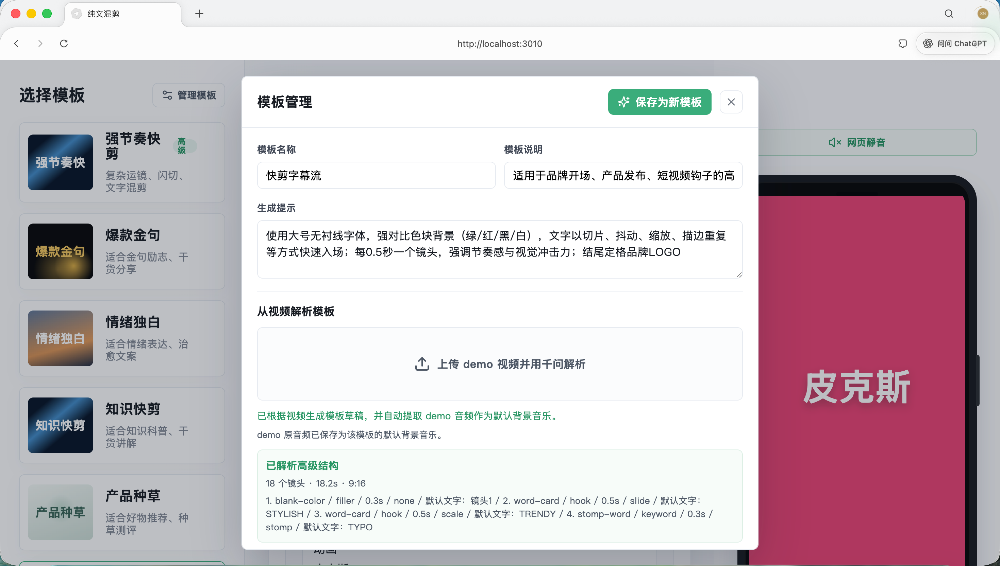
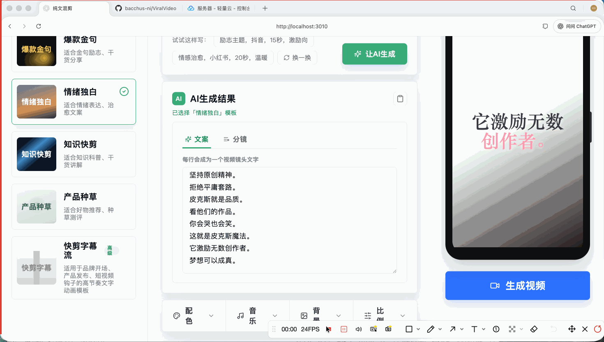
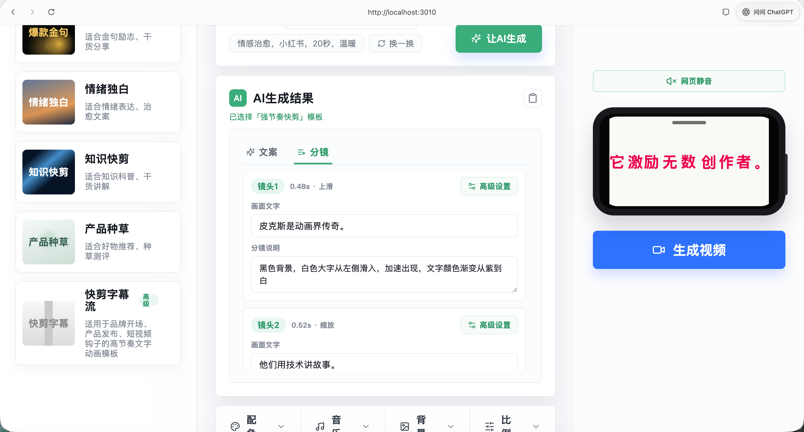
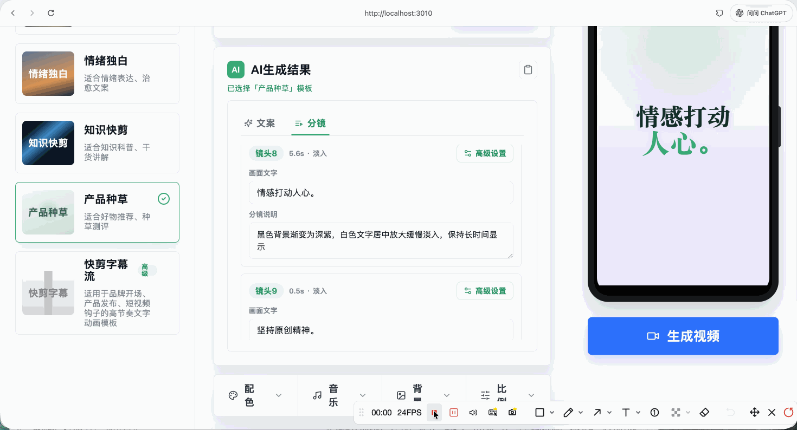
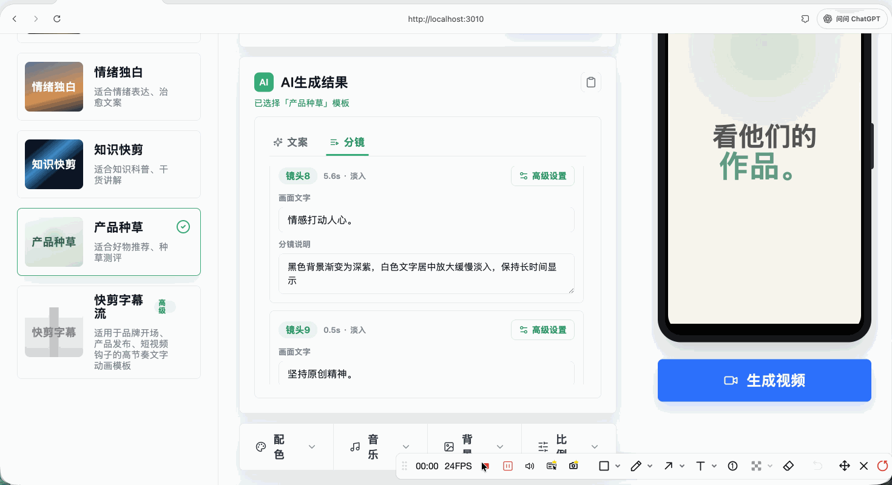
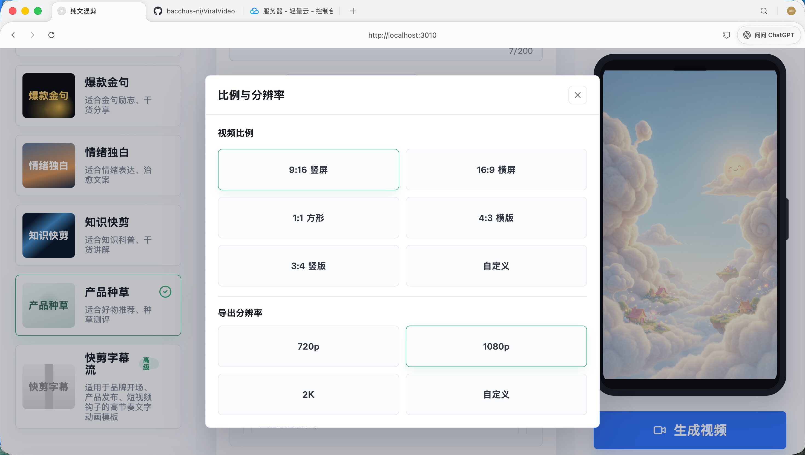

# 纯文本混剪视频生成器

一个面向「纯文本混剪」的 AI 视频生成工作台。

用户可以先选择一个预设模板，或上传 demo 视频让系统反向解析模板；随后用自然语言描述视频需求，由 DeepSeek 生成文案和分镜；再在页面里继续微调文案、分镜、配色、字体、背景、音乐、比例和单镜头高级效果；最后通过 Remotion 在本地渲染并导出 MP4。

项目当前重点不是做一个复杂剪辑软件，而是把「选择模板 -> 描述需求 -> AI 生成内容 -> 人工微调 -> 导出视频」这条链路做得尽量短、清楚、可控。

## 页面总览



主工作台分成三列：

- 左侧是模板区：选择预设模板、打开模板管理、右键删除模板。
- 中间是创作区：输入自然语言需求，查看和编辑 AI 生成结果，打开配色、音乐、背景、比例设置。
- 右侧是预览与导出区：Remotion Player 实时预览，支持网页静音、渲染进度、导出后下载 MP4。


## 核心工作流

```txt
选择/创建模板
  -> 用自然语言描述视频需求
  -> DeepSeek 生成文案和分镜
  -> 编辑文案、分镜和每个镜头的高级设置
  -> 调整配色、字体、背景、音乐、比例和分辨率
  -> Remotion 实时预览
  -> 本地渲染并导出 MP4
```

从 demo 视频创建模板：

```txt
上传 demo 视频
  -> 本地抽取 demo 原音频
  -> 调用千问多模态模型解析画面
  -> 识别镜头节奏、文字布局、动画、运镜、背景和配色
  -> 归一化为 Remotion 高级模板配置
  -> 将抽取音频设为模板默认背景音乐
  -> 保存为可复用模板
```

## 1. 选择模板

左侧模板栏内置了多种纯文本混剪模板，包括基础模板和高级 kinetic typography 模板。每个模板包含默认配色、背景、字体、音乐、提示词风格，部分模板还包含高级镜头槽位和复杂文字动画。

当前已包含的预设方向：

- 强节奏快剪：复杂运镜、闪切、文字混剪，适合高冲击标题卡。
- 爆款金句：黑金粒子背景，适合励志、干货分享。
- 情绪独白：渐变背景和慢节奏，适合治愈、表达、独白文案。
- 知识快剪：科技蓝色风格，适合知识科普、干货讲解。
- 产品种草：柔和背景，适合好物推荐、种草测评。
- 极简标题：留白和极简排版，适合品牌宣传。

模板支持右键删除。删除自定义模板会从本地模板记录中移除；删除预设模板会把模板 ID 写入本地隐藏列表，后续刷新页面也不会再显示。

## 2. 管理模板

点击左侧「管理模板」可以打开模板管理窗口。这里支持两种创建方式：

- 手动创建模板：填写模板名称、说明、生成提示，并配置配色、字体、背景、音乐。
- 从 demo 视频解析模板：上传一段参考视频，由千问多模态模型自动分析模板结构。

模板管理窗口中的配色、字体、背景、音乐设置与主工作台共用同一套组件，所以能力是一致的：可以选择预设，也可以上传背景/音乐，背景还可以调用千问文生图模型生成。



上传 demo 后，页面会显示解析进度，当前步骤包括：

- 读取 demo 视频。
- 抽取 demo 原音频。
- 上传给千问多模态模型。
- 识别镜头、转场和文字动画。
- 整理 Remotion 高级模板结构。

解析成功后会得到：

- 模板名称、模板说明和生成提示。
- 从 demo 视频归纳出的配色、字体、背景风格。
- 高级模板结构，包括镜头槽位、时长、起始时间、场景类型、文字角色、布局、运动、背景、转场。
- 从 demo 视频抽取出的音频文件，并自动作为该模板默认背景音乐。


<video controls src="docs/videos/02-template-analysis.mp4"></video>

## 3. 描述需求并生成文案

在「描述需求」区域输入自然语言即可，例如：

```txt
介绍皮克斯公司
```

点击「让 AI 生成」后，系统会把以下信息一起传给 DeepSeek：

- 当前选中的模板 ID、名称、说明。
- 模板自带的生成提示。
- 如果是高级模板，会附带模板槽位信息，要求 DeepSeek 按槽位数量生成文案和分镜。
- 用户输入的自然语言需求。
- 当前页面里的配色、字体、背景、音乐、比例等样式设置。

DeepSeek 返回后，本地会通过 Zod schema 做结构化校验和归一化。

<video controls src="docs/videos/03-generate-scripts-and-storyboards.mp4"></video>

## 4. 编辑完整文案

AI 生成结果里的「文案」是一个完整的大编辑框，而不是拆散的多个输入框。每一行会映射成一个视频镜头文字。

你可以直接在编辑框里：

- 调整句子顺序。
- 增删文案行。
- 缩短太长的文字，避免视频里挤压。
- 保持每行一句，让镜头切换更清楚。

编辑文案后，系统会同步更新 script 和 storyboard，并重新计算镜头时间线。



## 5. 生成并编辑分镜

切换到「分镜」后，可以逐个镜头编辑：

- 画面文字：当前镜头实际显示的文字。
- 分镜说明：对背景、文字入场、节奏、强调词、画面气质的描述。
- 高级设置：进入单镜头高级窗口，控制该镜头自己的文字、背景、入场、特效和高级模板参数。

基础分镜会渲染为普通纯文本镜头；如果模板包含高级结构，则会尽量按高级槽位渲染出更复杂的 kinetic typography 动效。



## 6. 单镜头高级设置

每个分镜都有「高级设置」按钮。这里可以做局部自定义，不影响其他镜头。

目前可调能力包括：

- 文字：单镜头文字色、强调色。
- 运动：镜头时长、入场效果。
- 特效：闪白、抖动、描边、发光，以及特效强度。
- 背景：跟随全局、纯色、渐变、粒子、图片。
- 背景图：可手动上传图片，也可调用千问文生图生成背景。
- 高级模板：如果当前模板带有高级槽位，可以切换高级镜头类型、高级入场方式和强调效果。

高级模板支持的场景类型包括：

- 色块擦入。
- 文字卡片。
- 裁切分裂。
- 冲击字。
- 字散归位。
- 描边阵列。
- 长停留。
- 撞色过渡。
- 堆叠标题。

支持的高级入场和强调效果包括擦入、冲击、滑入、缩放、散开、打字、抖动、闪白、倾斜、裁切、描边和阵列。

分镜高级设置演示视频占位：

<video controls src="docs/videos/03-shot-customization.mp4"></video>

## 7. 配色与字体

底部「配色」窗口整合了全局配色和字体设置。

配色能力：

- 内置黑金配色、马卡龙色系、清新蓝、极简白、深色霓虹、自然绿。
- 支持自定义背景、层次、主文字、强调色、辅助色。
- 自定义配色会保存到浏览器 localStorage，之后可以重复调用。

字体能力：

- 支持黑体、宋体、圆体、衬线等字体气质。
- 字号不是强制所有文字同一个固定值，而是控制整体文字规模，具体镜头仍会根据布局和模板效果做适配。
- 支持字重调节，用于控制标题冲击力。



## 8. 背景设置与 AI 生图

底部「背景」窗口支持全局背景设置：

- 粒子特效。
- 柔和渐变。
- 纯色背景。
- 质感光影。
- 上传图片作为背景。
- 调用千问文生图模型生成无文字背景。

AI 背景图会调用后端 `/api/generate-background-image`，生成成功后保存到 `public/generated-backgrounds/`，并立即应用到右侧预览和最终导出。



## 9. 音乐设置与网页静音

底部「音乐」窗口支持：

- 使用模板默认背景音乐。
- 切换内置背景音乐。
- 上传本地音频作为背景音乐。
- 调整音乐音量。
- 移除背景音乐。

内置音乐包括：

- 强节奏快剪。
- 情绪铺底。
- 知识脉冲。
- 轻快种草。
- 极简氛围。

右侧预览区还有一个「网页静音 / 预览有声」按钮。这个按钮只影响浏览器里的预览播放，不会改变导出视频中的声音。


<video controls src="docs/videos/09-music-settings.mp4"></video>

## 10. 比例、分辨率与实时预览

底部「比例」窗口支持：

- 9:16 竖屏。
- 16:9 横屏。
- 1:1 方形。
- 4:3 横版。
- 3:4 竖版。
- 自定义比例。

导出分辨率支持：

- 720p。
- 1080p。
- 2K。
- 自定义宽高。

右侧 Remotion Player 会根据当前比例和分辨率实时调整预览画布。所有文案、分镜、配色、字体、背景、音乐和高级镜头设置都会反映到预览里。



## 11. 生成并导出视频

点击右侧「生成视频」后，页面会调用 `/api/render-video`，使用 Remotion 在本地渲染 MP4。

渲染期间会显示：

- 生成中按钮状态。
- 正在渲染视频提示。
- 渲染进度条。
- 当前合成说明。

渲染完成后会出现下载入口。导出视频会写入 `public/renders/`，页面返回可下载链接。


<video controls src="docs/videos/04-render-export.mp4"></video>

## 已实现能力清单

### 模板

- 预设模板选择。
- 高级模板标记。
- 自定义模板保存到 localStorage。
- 右键删除模板。
- 模板管理窗口。
- 上传 demo 视频生成模板。
- demo 视频音频自动抽取并作为模板默认音乐。
- 千问解析出的高级模板结构会经过本地 schema 归一化。

### AI 生成

- DeepSeek 生成文案和分镜。
- 高级模板槽位感知生成。
- DeepSeek 异常时自动使用本地兜底示例。
- AI 结果显示来源提示和 warning。

### 文案与分镜编辑

- 文案使用完整编辑框。
- 文案每行映射为一个镜头。
- 分镜支持逐镜头编辑画面文字和说明。
- 分镜高级设置支持单镜头文字色、强调色、时长、入场、特效、背景。
- 高级模板镜头支持场景类型、入场方式、强调效果编辑。

### 视觉设置

- 全局配色预设。
- 自定义配色并持久化。
- 字体、字号整体规模、字重。
- 全局背景：纯色、渐变、粒子、图片。
- 单镜头背景：跟随全局、纯色、渐变、粒子、图片。
- 上传图片作为全局或单镜头背景。
- 千问文生图生成背景。

### 音频

- 每个模板可带默认背景音乐。
- 内置多套背景音乐。
- 上传本地音频。
- 音量控制。
- 网页预览静音，不影响导出。

### 预览与导出

- Remotion Player 实时预览。
- 预览画布响应比例和分辨率设置。
- 本地 Remotion 渲染 MP4。
- 渲染进度提示。
- 渲染完成后下载视频。

## 技术栈

- Next.js 14
- React 18
- TypeScript
- Remotion 4
- Zod
- DeepSeek Chat API
- 千问多模态模型，使用 DashScope OpenAI-compatible API
- 千问文生图 API
- FFmpeg，用于 demo 视频音频抽取和渲染辅助

## 本地运行

安装依赖：

```bash
npm install
```

复制环境变量文件：

```bash
cp .env.example .env.local
```

配置 `.env.local`：

```bash
DEEPSEEK_API_KEY=
DEEPSEEK_MODEL=deepseek-v4-flash

QWEN_API_KEY=
QWEN_BASE_URL=https://dashscope.aliyuncs.com/compatible-mode/v1
QWEN_VL_MODEL=qwen3-vl-plus
QWEN_IMAGE_MODEL=qwen-image-2.0-pro
QWEN_IMAGE_ENDPOINT=https://dashscope.aliyuncs.com/api/v1/services/aigc/multimodal-generation/generation
```

启动开发服务器：

```bash
npm run dev
```

打开页面：

```txt
http://localhost:3010
```

## 常用命令

```bash
npm run dev              # 启动 Next.js 开发服务器
npm run typecheck        # TypeScript 类型检查
npm run build            # 构建 Next.js 应用
npm run remotion:studio  # 打开 Remotion Studio
npm run remotion:render  # 使用默认参数渲染示例视频
```

## 项目结构

```txt
app/
  api/
    analyze-template-video/  # 千问解析 demo 视频并抽取音频
    generate-background-image/ # 千问文生图生成背景图
    generate-plan/           # DeepSeek 生成文案和分镜
    render-video/            # Remotion 本地渲染 MP4
components/
  settings/                  # 配色、文字、背景、音乐、比例、运动等共享设置组件
  GeneratedPlanCard.tsx       # AI 结果、文案编辑、分镜编辑
  PhonePreview.tsx            # Remotion 预览与导出入口
  PromptComposer.tsx          # 自然语言需求输入
  StyleBar.tsx                # 底部全局设置入口
  TemplateManagerModal.tsx    # 模板管理与 demo 视频解析
  TemplatePicker.tsx          # 左侧模板选择与右键删除
lib/
  advanced-template.ts        # 高级模板归一化与槽位重排
  deepseek.ts                 # DeepSeek 请求与返回归一化
  render.ts                   # Remotion 渲染工具
  schemas.ts                  # Zod schema 与类型
  style-presets.ts            # 配色、字体、音乐、背景、比例预设
  templates.ts                # 内置模板
remotion/
  scenes/                     # Remotion 场景、背景、文字动效
  TextMixComposition.tsx       # 基础纯文本混剪 composition
  KineticTextComposition.tsx   # 高级 kinetic typography composition
public/
  music/                      # 内置背景音乐和模板解析音频
  generated-backgrounds/       # 千问文生图输出
  renders/                    # 导出视频
docs/
  screenshots/                # README 截图占位
  videos/                     # README 视频演示占位
```

## 输出与临时文件

- 渲染后的视频会输出到 `public/renders/`。
- demo 视频抽取出的模板音频会保存到 `public/music/template-audio/`。
- 千问文生图生成的背景会保存到 `public/generated-backgrounds/`。
- 上传分析过程中的临时文件会写入 `.uploads/`。

这些目录用于本地运行和调试，不建议提交到 Git，除非你希望把示例素材固定在仓库里。

## 注意事项

- demo 视频解析依赖千问多模态模型，需要配置 `QWEN_API_KEY`。
- AI 背景图依赖千问文生图模型，默认使用 `QWEN_IMAGE_MODEL=qwen-image-2.0-pro`。
- DeepSeek key 缺失时，页面仍可以使用本地兜底文案，方便调 UI 和预览。
- 当前 demo 视频上传大小默认限制为 20MB。
- 1080p 和 2K 导出会启动浏览器逐帧渲染，耗时会明显高于页面预览。
- AI 解析出的高级模板会经过本地 schema 归一化，但复杂视频仍可能需要人工微调。
- README 中的图片和视频路径目前是占位，素材文件加入后才会正常显示。
