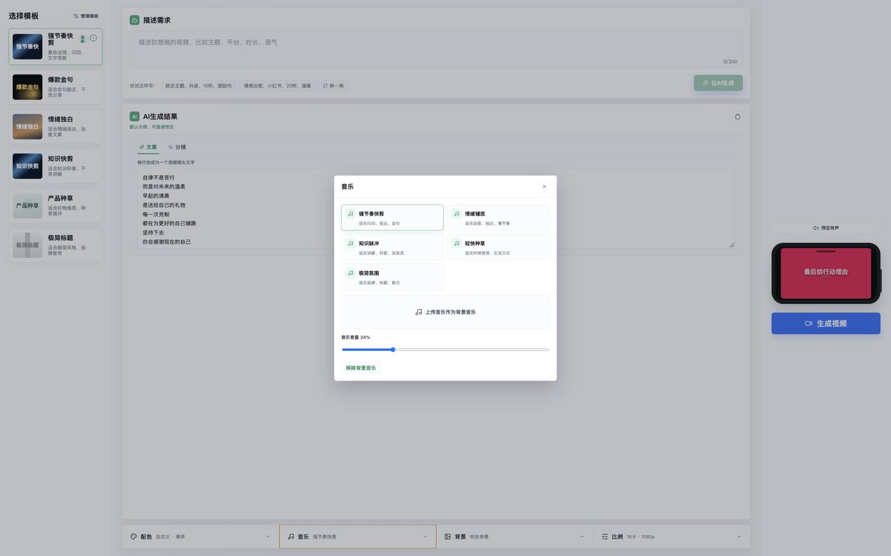
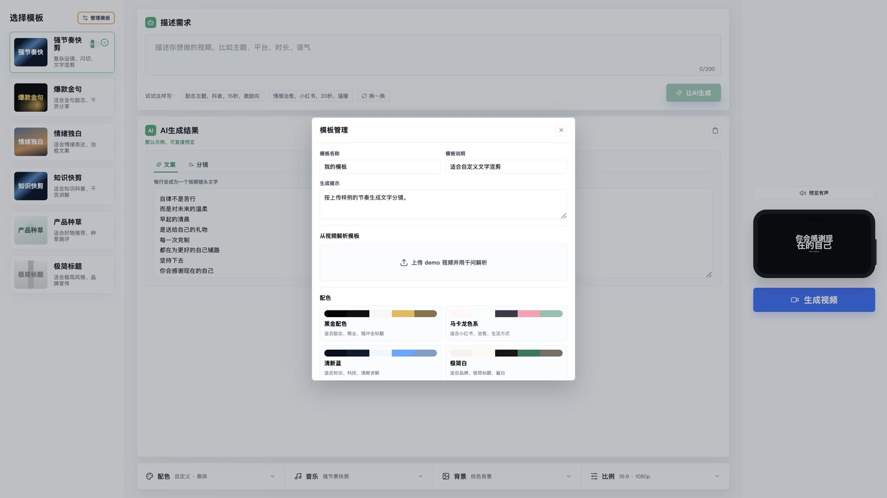

# 纯文本混剪视频生成器

一个面向「纯文本混剪」的极简视频生成工作台。用户选择模板后，用自然语言描述需求，系统通过 DeepSeek 生成文案和分镜，再交给 Remotion 做实时预览与本地 MP4 渲染。

项目也支持从 demo 视频反向解析模板：上传参考视频后，系统会抽取视频音频作为模板默认背景音乐，并调用千问多模态模型分析镜头节奏、文字布局、动画、运镜、背景和配色，生成可复用的 Remotion 模板配置。

## 页面预览

### 主工作台

左侧选模板，中间写需求和编辑 AI 结果，右侧实时预览视频。底部集中放置样式、音乐、背景和比例设置，尽量降低首次使用门槛。


### 音乐设置

模板自带背景音乐，也可以在音乐窗口里切换预设音乐、上传本地音乐、调整背景音量。网页静音只影响预览播放，不会改变最终导出视频里的声音。



### 模板管理

模板管理支持手动创建模板，也支持上传 demo 视频让千问解析模板结构。解析成功后会保存模板，并把从 demo 视频抽取出的音频作为该模板的默认背景音乐。



## 核心流程

```txt
选择模板
  -> 描述视频需求
  -> DeepSeek 生成文案和分镜
  -> 编辑文案、分镜、配色、字体、背景、音乐、比例
  -> Remotion 实时预览
  -> 本地渲染并导出 MP4
```

从 demo 视频创建模板：

```txt
上传 demo 视频
  -> 抽取音频
  -> 千问多模态解析画面与节奏
  -> 归一化为高级模板配置
  -> 保存为可复用模板
```

## 已实现能力

- 预设模板选择：强节奏快剪、爆款金句、情绪独白、知识快剪、产品种草、极简标题。
- 自然语言生成：调用 DeepSeek 生成完整文案和分镜说明，未配置 key 时提供本地兜底示例。
- 结果可编辑：文案是完整编辑框，分镜支持逐镜头编辑。
- 实时预览：右侧 Remotion Player 会响应文案、分镜、配色、字体、背景、音乐和比例变化。
- 样式设置：支持预设配色、自定义配色、字体、字号整体缩放、字重、纯色背景、渐变、粒子和上传图片背景。
- AI 背景图：背景窗口可调用千问文生图生成无文字背景，并保存到本地用于预览和导出。
- 音乐设置：支持模板默认音乐、预设音乐、用户上传音乐、音量控制和网页静音。
- 比例与分辨率：支持 4:3、16:9、9:16 等常见比例，也支持自定义比例和 720p、1080p、2K 导出分辨率。
- 视频导出：通过 Remotion CLI 在本地渲染 MP4，并在页面展示渲染进度。
- 模板管理：支持手动创建模板，也支持上传 demo 视频并用千问解析高级模板。
- demo 音频复用：解析 demo 视频时会自动抽取音频，并作为新模板的默认背景音乐。

## 技术栈

- Next.js 14
- React 18
- TypeScript
- Remotion 4
- Zod
- DeepSeek Chat API
- 千问多模态模型，使用 DashScope OpenAI-compatible API
- FFmpeg，用于 demo 视频音频抽取和 Remotion 渲染辅助

## 本地运行

安装依赖：

```bash
npm install
```

复制环境变量文件：

```bash
cp .env.example .env.local
```

配置 `.env.local`：

```bash
DEEPSEEK_API_KEY=
DEEPSEEK_MODEL=deepseek-v4-flash

QWEN_API_KEY=
QWEN_BASE_URL=https://dashscope.aliyuncs.com/compatible-mode/v1
QWEN_VL_MODEL=qwen3-vl-plus
QWEN_IMAGE_MODEL=qwen-image-2.0-pro
QWEN_IMAGE_ENDPOINT=https://dashscope.aliyuncs.com/api/v1/services/aigc/multimodal-generation/generation
```

启动开发服务器：

```bash
npm run dev
```

打开页面：

```txt
http://localhost:3010
```

## 常用命令

```bash
npm run dev              # 启动 Next.js 开发服务器
npm run typecheck        # TypeScript 类型检查
npm run build            # 构建 Next.js 应用
npm run remotion:studio  # 打开 Remotion Studio
npm run remotion:render  # 使用默认参数渲染示例视频
```

## 项目结构

```txt
app/
  api/
    analyze-template-video/  # 千问解析 demo 视频并抽取音频
    generate-plan/           # DeepSeek 生成文案和分镜
    render-video/            # Remotion 本地渲染 MP4
components/                  # 页面主工作台和弹窗组件
lib/                         # schema、模板、风格预设、LLM 请求和渲染工具
remotion/                    # Remotion Composition 与场景组件
public/music/                # 内置背景音乐
docs/screenshots/            # README 网页截图
```

## 输出与临时文件

- 渲染后的视频会输出到 `public/renders/`。
- demo 视频抽取出的模板音频会保存到 `public/music/template-audio/`。
- 千问文生图生成的背景会保存到 `public/generated-backgrounds/`。
- 上传分析过程中的临时文件会写入 `.uploads/`。

这些目录用于本地运行和调试，不建议提交到 Git。

## 注意事项

- demo 视频解析依赖千问多模态模型，需要配置 `QWEN_API_KEY`。
- AI 背景图依赖千问文生图模型，默认使用 `QWEN_IMAGE_MODEL=qwen-image-2.0-pro`。
- DeepSeek key 缺失时，页面仍可以使用本地兜底文案，方便调 UI 和预览。
- 当前 demo 视频上传大小默认限制为 20MB。
- 1080p 和 2K 导出会启动浏览器逐帧渲染，耗时会明显高于页面预览。
- AI 解析出的高级模板会经过本地 schema 归一化，但复杂视频仍可能需要人工微调。
